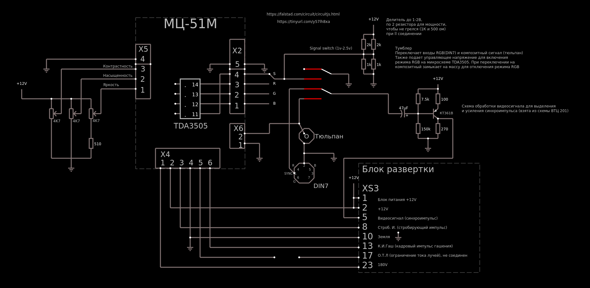
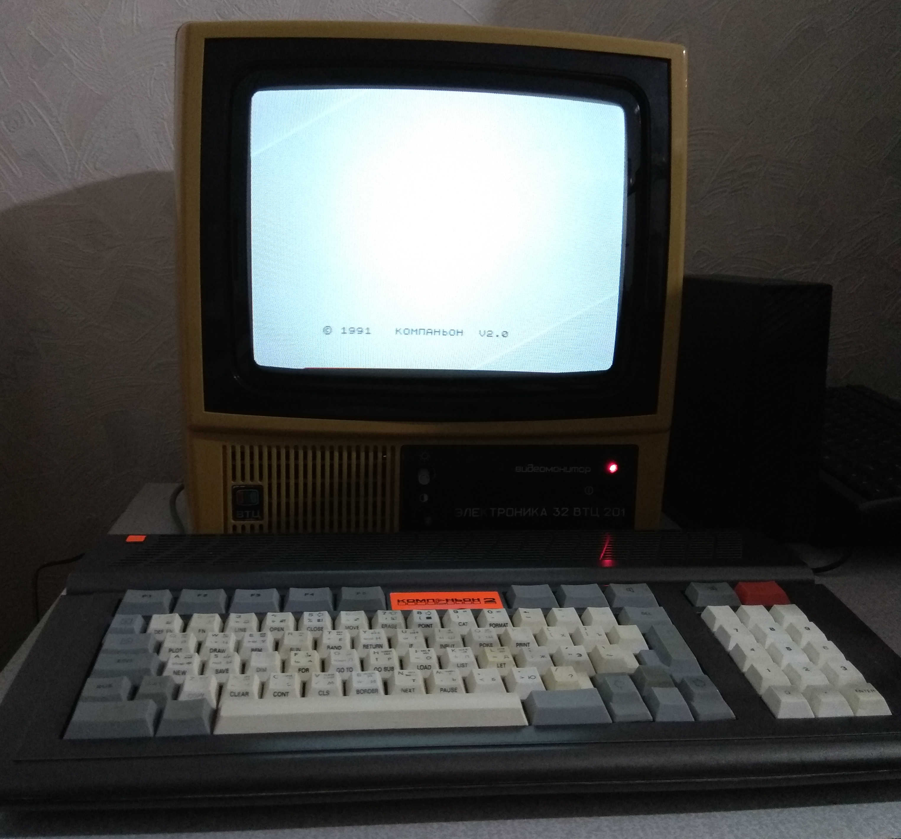

### Электроника 32 ВТЦ-201

Доработка видеомонитора Электроника 32 ВТЦ-201 под модуль цветности МЦ-51М

Появилась возможность подключения композитного сигнала и непосредственно RGB сигнала 

* Композитный - разъем RCA  (тюльпан, AV-разъём)
* RGB - разъем DIN7. Аналоговый RGB сигнал Спектрум-совместимого компьютера. В разъеме три канала (R G B), синхроимпульс и земля (корпус). +5 и звук не используются  

***  

1. Удалить блок видеоканала (А5)
2. Установить модуль цветности (в моем случае МЦ-51М)
3. Модуль цветности: к разъему Х3 подключить выходы R, G и B, идущие на плату кинескопа (А6)
4. Модуль цветности: разъем Х4 соединить с блоком разверток (разъем ХР3) соответствующими по названию контактами
5. Модуль цветности: к разъему Х5 подключить три переменных резистора на 4.7Ком для регулировки яркости, насыщенности и цветности 
6. Модуль цветности: к разъему Х6 подключить разъем RCA
7. Модуль цветности: к разъему Х2 подключить входящий RGB и корпус с DIN7  
  
  Для правильной работы блока разверток необходим амплитудный селектор, в данном устройстве он размещен в схеме блока видеоканала (А5) и состоит из одного транзистора КТ361В с обвязкой. Схема однокаскадного амплитудного селектора служит для выделения синхросмеси из видеосигнала (композитного из RCA или специальный синхроимпульс идущий вместе с RGB) и синхронизации генераторов развертки.  
Так как блок видеоканала удаляется, нужно собрать такую же схему. Собрать можно на макетной плате или навесным монтажом. Схема в приложении.  
Детали:  
Транзистор - КТ361В  
Резисторы - 150 Ком, 270 Ом, 100 Ом, 7.5 Ком  
Конденсатор электролитический - 47мкф х 16В  
Переключатель - тумблер двухрядный  
  
  Так же необходим делитель напряжения с 12В до 1-2В для подачи управляющего напряжения для включения режима RGB на микросхеме TDA3505 в модуле цветности
Резисторы - 1Ком и 500ом 

8. Амплитудный селектор: к входу на конденсатор подключить центральный контакт тумблера, к другим контактам этой группы подключить контакт с синхроимпульсом RGB(DIN7) и композитный сигнал RCA соответственно
9. Амплитудный селектор: выход селектора (коллектор транзистора) подключить к блоку разверток (разъем ХР3) к соответствующему контакту
10. Тумблер: центральный контакт свободной группы контактов соединить с корпусом (землей). Сюда же вторым контактом выбрать тот, который при переключении на композитный вход (первая группа из п.8) будет замыкать на центральный. К нему подключить среднюю точку делителя напряжения
11. Модуль цветности: к разъему Х2 подключить среднюю точку делителя напряжения (и тумблер соответственно). В зависимости от положения тумблера, будет включаться режим RGB в модуле цветности. При переключении на композитный, управляющий вход будет замыкаться на корпус для отключения режима RGB  
  
  

  
  

